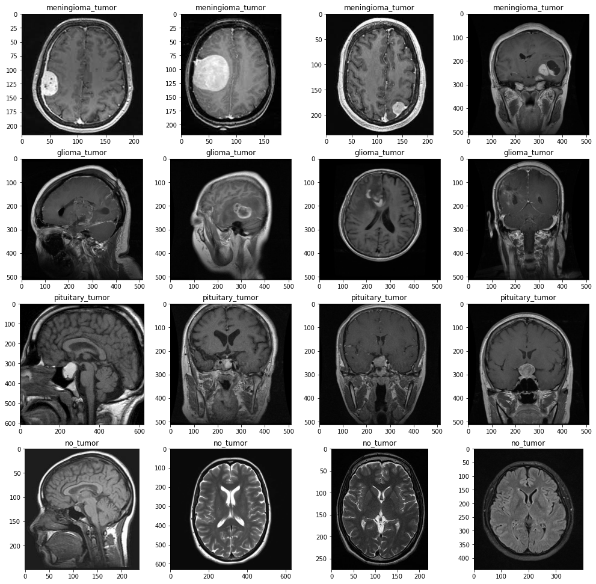
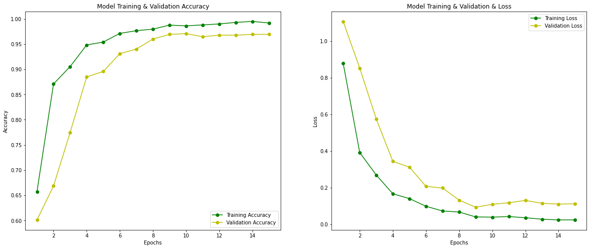
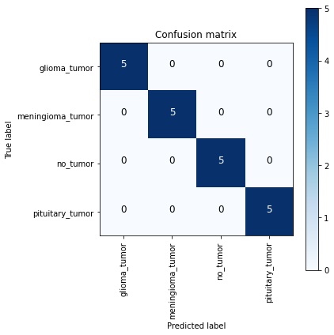
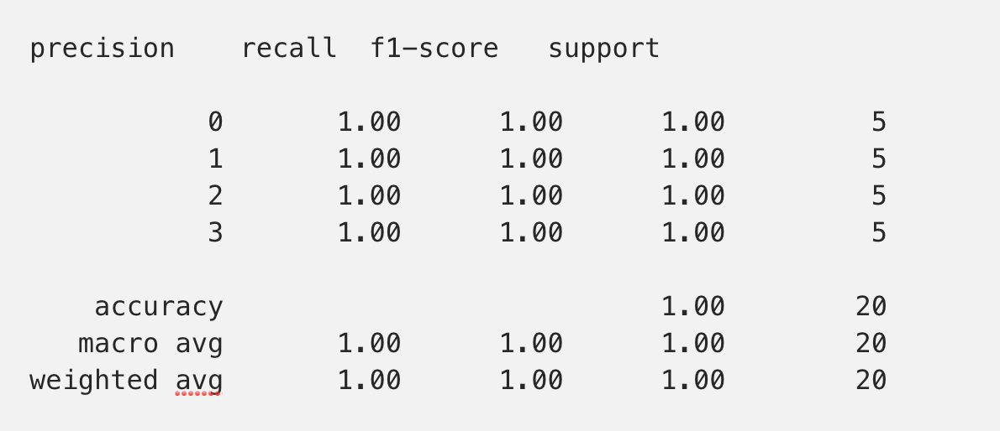
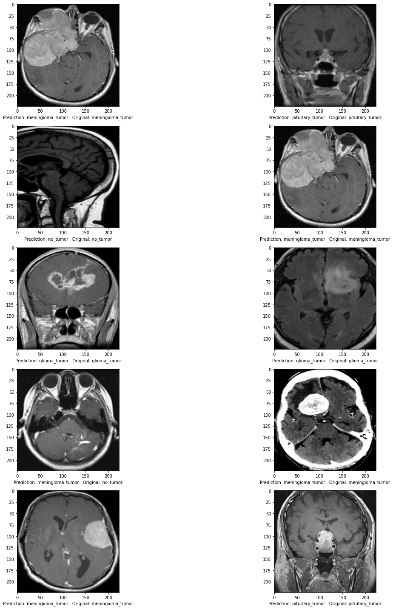
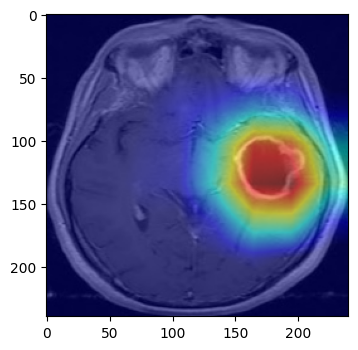
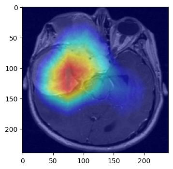
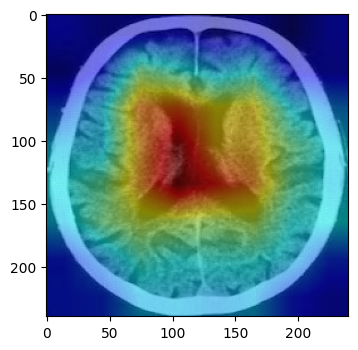
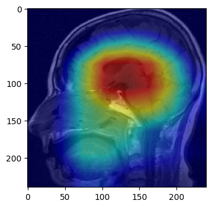

# Brain Tumor Classification with EfficientNet CNN and Grad-CAM Visualization

## Blog

[Medium Blog](https://baotramduong.medium.com/explainable-ai-brain-tumor-classification-with-efficientnet-and-gradient-weighted-class-activation-24c57ae6175d)

## Introduction

This project builds and trains an EfficientNet-based model to classify brain MRI scans into four classes:

- `glioma_tumor`
- `meningioma_tumor`
- `no_tumor`
- `pituitary_tumor`

It also uses Grad-CAM to visualize which regions of the MRI influenced the model's prediction.

## Core Project Structure

This repository is organized around one main ML workflow and separate deployment layers:

- `Notebook.ipynb` is the main project asset. It contains the original training, validation, testing, evaluation, and Grad-CAM workflow.
- `models/model.keras` is the trained artifact exported from the notebook workflow or regenerated from the same dataset and architecture.
- `app/brain_tumor_ui/inference.py` is the shared inference bridge that reuses the notebook's preprocessing, class order, and prediction behavior.
- `backend/` is the API deployment layer.
- `frontend/` is the React user interface deployment layer.
- `docs/` contains deployment and full-stack setup guides.

The notebook remains the source of truth for model development. The backend and frontend exist to serve the trained model, not to replace the notebook.

## Architecture

1. Train and validate the model in `Notebook.ipynb`.
2. Export the trained artifact to `models/model.keras`.
3. Load the trained artifact through the inference layer.
4. Serve predictions through the FastAPI backend.
5. Display results and Grad-CAM visualizations in the React frontend.

This separation is a strength for interviews and CVs because it shows both ML experimentation and production-style deployment design.

## Data Source

The dataset contains 3,285 brain MRI images across four tumor classes. It can be accessed from Kaggle or cloned from this repository:

[Coursera Content Dataset Repo](https://github.com/Ashish-Arya-CS/Coursera-Content)

## Exploratory Data Analysis

## Modeling

### Model Evaluation

## Prediction

## Grad-CAM

### Glioma Tumor

### Meningioma Tumor

### No Tumor

### Pituitary Tumor

## React + FastAPI Deployment

A full-stack deployment version is also available for portfolio and recruiter-facing presentation.

- Backend API: `backend/app/main.py`
- React frontend: `frontend/`
- Public deployment guide: `docs/DEPLOYMENT.md`
- Full-stack guide: `docs/FULLSTACK.md`

This full-stack version should be treated as the deployed product layer around the notebook-trained model, not as a replacement for the notebook.

## Suggested CV Description

`Trained and validated an EfficientNet-based brain tumor MRI classifier in Jupyter Notebook, then deployed the trained model through a FastAPI backend and React frontend for interactive inference and Grad-CAM visualization.`

## References

Agarwal, V. (2020, May 23). Complete architectural details of all efficientnet models. Medium. https://towardsdatascience.com/complete-architectural-details-of-all-efficientnet-models-5fd5b736142

Arya, A. Brain tumor classification using Keras [MOOC]. Coursera. https://www.coursera.org/projects/brain-tumor-classification-using-keras-jbek2?courseSlug=brain-tumor-classification-using-keras-jbek2&showOnboardingModal=check

Kermany, D. S., et al. (2018). Identifying Medical Diagnoses and Treatable Diseases by Image-Based Deep Learning. Cell, 172(5), 1122-1131.e9. https://doi.org/10.1016/j.cell.2018.02.010

Quick brain tumor facts. National Brain Tumor Society. https://braintumor.org/brain-tumor-information/brain-tumor-facts/

Siddhartha. (2019, June 5). CAM visualization of EfficientNet. https://sidml.github.io/efficientnet-gradcam-comparison-to-other-models/

Tan, M.; Le, Q. (2019). EfficientNet: Rethinking Model Scaling for Convolutional Neural Networks. https://proceedings.mlr.press/v97/tan19a.html

Rosebrock, A. (2020, March 9). Grad-CAM: Visualize Class Activation Maps with Keras, TensorFlow, and Deep Learning. https://www.pyimagesearch.com/2020/03/09/grad-cam-visualize-class-activation-maps-with-keras-tensorflow-and-deep-learning/
